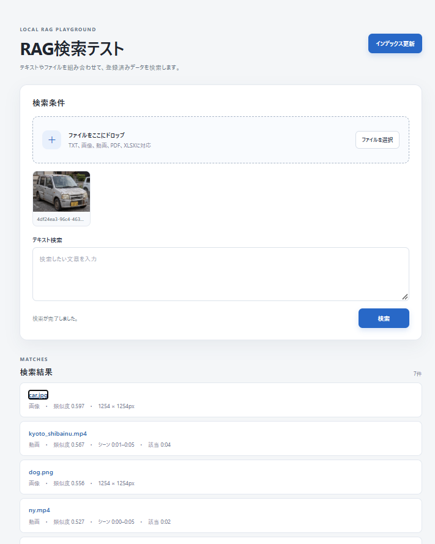
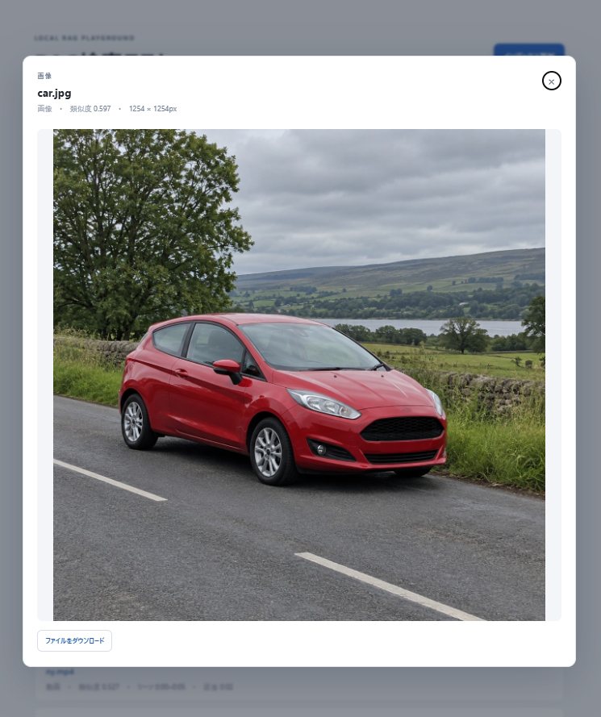
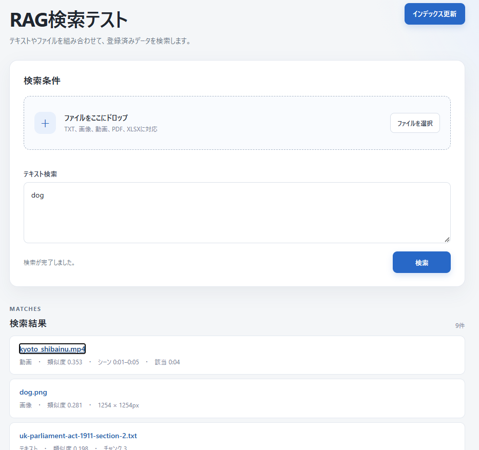
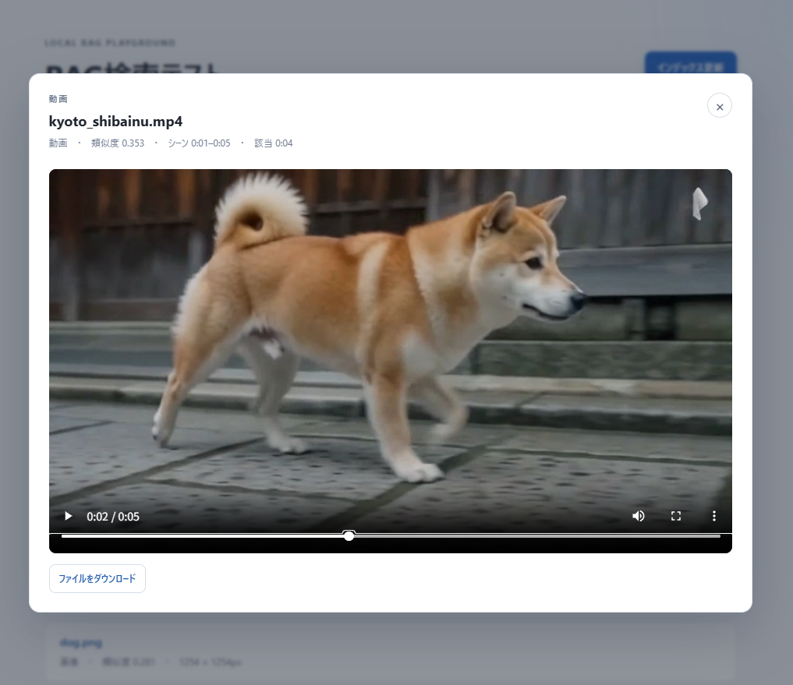

# マルチモーダルRAG検索 PoC Phase 1

## プロジェクトの目的と検証範囲

このプロジェクトは、Windows 11とNVIDIA GeForce RTX 3070の環境で、テキスト・画像・動画を扱うマルチモーダルRAG検索を検証するPoCである。対象はEmbedding生成とベクトル検索までで、LLMによる回答生成は含まない。これまでの確認では、テキストファイル・画像・動画を登録し、各形式を検索クエリに使えることを確認した。検索対象は、テキストクエリがテキスト・画像・動画、画像クエリが画像・動画、動画クエリが動画である。

RAG本体はUbuntu上で動作し、Windows固有の処理はWSL2の構築や起動を担う。したがってLinuxへの移植は比較的容易と見込む。ただし、現状のセットアップはPowerShell、WSLのディストリビューション管理、Windows側のパスを前提としており、Linux上での動作は未確認である。移植時はセットアップ・起動スクリプトとパス設定の置き換え、およびGPU・依存関係の再確認が必要になる。

### 似た環境の人は次のコマンドインストールできるの試してみてね
```powershell
$OutputEncoding = [System.Text.UTF8Encoding]::new($false)
Get-Content .\rag\README.md -Raw -Encoding UTF8 | codex exec -C . "READMEの手順に従って環境をセットアップし、スモークテストと同梱テストデータのインデックス作成まで実行してください。前提条件が不足または確認不能なら、インストールや変更をせず停止して報告してください。"
```

## 技術スタック

### Phase 1で使用中

| 項目 | 技術・構成 |
| --- | --- |
| ホストOS | Windows 11 |
| Linux環境 | 専用WSL 2ディストリビューション `RAG-Ubuntu`（Ubuntu 24.04.5） |
| GPU | NVIDIA GeForce RTX 3070 8GB。Windows側のNVIDIAドライバーを使い、WSLからCUDAを利用する |
| 言語・実行環境 | Python 3.12、WSL内のvenv |
| GPU推論 | PyTorch 2.11.0+cu128、CUDA 12.8 |
| マルチモーダルEmbedding | Jina CLIP v2でテキストと画像・動画フレームを共通のベクトル空間に変換。ベクトル次元数は1024。モデルと補助コードのリビジョンは `model-cache.json` で固定 |
| マルチモーダル検索 | テキストクエリはテキスト・画像・動画、画像クエリは画像・動画、動画クエリは動画を検索 |
| AIライブラリ | Sentence Transformers 3.4.1、Transformers 4.48.3 |
| ベクトルDB | Qdrant Local Mode（qdrant-client 1.19.1）。DBはWSLのLinuxファイルシステム内に保存 |
| インデックス状態管理 | SQLiteとファイル内容ハッシュ。未変更ファイルの再登録を省き、更新ファイルを判定 |
| テキスト処理 | TXTをチャンク化して登録。チャンク幅1000文字、重複幅100文字 |
| 画像処理 | Pillowによる読み込みと画像Embedding |
| 動画処理 | FFmpegによるフレーム抽出、PySceneDetect 0.7.1によるシーン検出。シーン代表フレームと5秒間隔のフレームを登録 |
| CLI | `index.py` と `search.py`。検索結果などの標準出力はJSON |
| デモUI | Python標準ライブラリの `HTTPServer` と静的HTML/CSS/JavaScript |
| Codex連携 | Codex CLIからWSL内のPython CLIを実行。MCPとDockerは使用しない |
| キャッシュ・一時データ | モデル、Qdrant、SQLite、動画フレーム、一時ファイルをWSL仮想ディスク内に保存 |

### 今後の導入候補（Phase 1では未使用）

| 用途 | 候補技術 | 状況 |
| --- | --- | --- |
| PDF・DOCX処理 | Docling | Phase 2候補。現行の入力対象外 |
| XLSX処理 | openpyxl | Phase 2候補。現行の入力対象外 |
| OCR | RapidOCR、必要に応じてTesseract | Phase 2候補。現行では未実装 |
| 動画音声の文字起こし | faster-whisper | Phase 3候補。現行では未実装 |
| 複数プロセス・高負荷時のベクトルDB | WSL上のQdrant Server | 必要になった場合に移行を検討。現行はQdrant Local Mode |

## 固定要件

- リポジトリはWSLから参照できるドライブ文字付きのローカルパスに置く。RAGのコード、データ、スクリプト、モデル取得キャッシュ、WSL仮想ディスクを含む管理対象ファイルはすべてリポジトリ内の `rag\` の下に置く。UNCパスは使わない。
- リポジトリルート直下にRAG用ファイルを作らない。
- Windows GPUドライバー、Microsoft WSL共有カーネル、ディストリビューションの登録情報はOS管理対象とする。WSL内にLinux版NVIDIAドライバーを入れない。
- Microsoft Store版Ubuntuアプリは追加せず、Ubuntu 24.04.5の専用WSL 2ディストリビューション `RAG-Ubuntu` を `rag\.wsl\RAG-Ubuntu\` に登録する。
- 既存の `Ubuntu` ディストリビューションは変更しない。
- Phase 1ではTXT、JPG/JPEG/PNG、MP4/MOV/MKV/AVI/WEBMを扱うマルチモーダルRAG検索を対象にする。EmbeddingはJina CLIP v2、ベクトルDBはQdrant Local。
- Docker、MCP、回答生成LLM、PDF/DOCX/XLSX、OCR、音声検索は対象外。

## 保存場所

| 内容 | 保存先 |
| --- | --- |
| 実装、CLI、手順書、セットアップスクリプト | `rag\` |
| 同梱テスト入力 | `rag\data\rag-test-data\`（Gitで管理） |
| 追加の入力 | `rag\data\`（同梱テストデータ以外はGitで管理しない） |
| Ubuntuイメージとチェックサム | `rag\.bootstrap\` |
| WSL仮想ディスク（Python環境、モデル、pip/HFキャッシュ、Qdrant、作業用一時ファイル） | `rag\.wsl\RAG-Ubuntu\ext4.vhdx` 内の `/home/rag/rag-runtime/` |
| CLI出力 | JSONを標準出力へ出力。必要な成果物は `rag\output\` に置く |

WSL内のLinuxパスはVHDXの中に保存されるため、物理的な保存場所もプロジェクトの `rag\.wsl\` 配下になる。ベクターデータベースやキャッシュ、一時ファイルは各PCで再生成し、Gitには含めない。モデルの利用規約はCC BY-NC 4.0で、商用利用不可。

## WSL内の環境設定

アプリは `src/rag_poc/config.py` で保存先を固定する。モデル系ライブラリを読み込む前に環境変数を設定し、キャッシュや一時ファイルをWindowsユーザープロファイルなどへ散らさず、WSL VHDX内に保存する。

| 環境変数 | 固定値 | 用途 |
| --- | --- | --- |
| `RAG_RUNTIME_DIR` | `/home/rag/rag-runtime` | WSL内の実行データの基準ディレクトリ |
| `HF_HOME` | `/home/rag/rag-runtime/cache/huggingface` | Hugging Faceのモデル・tokenizer・コードキャッシュ |
| `TORCH_HOME` | `/home/rag/rag-runtime/cache/torch` | PyTorchキャッシュ |
| `XDG_CACHE_HOME` | `/home/rag/rag-runtime/cache/xdg` | Linuxアプリ共通キャッシュ |
| `PIP_CACHE_DIR` | `/home/rag/rag-runtime/cache/pip` | pipパッケージキャッシュ |
| `TMPDIR` | `/home/rag/rag-runtime/tmp` | PythonやFFmpegなどの一時ファイル |
| `HF_HUB_OFFLINE` | `1` | 通常実行でHugging Face Hubへ接続せず、準備済みキャッシュを使う |

`prepare-model-cache.py` はモデル準備中だけHubへの接続を許可し、固定版をキャッシュしてから各リポジトリの `main` 参照も固定コミットに合わせる。実際のインデックス・検索では `HF_HUB_OFFLINE=1` が有効になり、オンライン更新によるモデルコードの差し替わりを防ぐ。Qdrantの永続データ、インデックス状態SQLite、動画フレーム、ログも同じ `/home/rag/rag-runtime/` 内に保存する。

## 環境の再構築

環境構築前に、Windows上でWSL 2とCUDA対応のNVIDIAドライバーが利用できることを確認する。Ubuntu、Python依存関係、モデルの取得にはインターネット接続が必要。

Codex CLIから実行する場合は、Codex CLIもインストール済みで利用できること。前提が不足している、または確認できない場合はセットアップを始めず、不足項目を報告する。CodexはWSLやGPUドライバーをインストールしない。WSL内へLinux版GPUドライバーを別途インストールしない。

現在確認済みの構成はWindows 11（OSビルド 10.0.26200.9168）、WSL 2.4.10、RTX 3070 8GB、Windowsドライバー 595.95。

### Codex CLIからのセットアップ

PowerShellでリポジトリのルートを開き、次を実行する。Windows PowerShell 5.1とPowerShell 7の両方でREADMEの日本語を保つため、ファイル読み込みとCodexへの入力をUTF-8にする。README全体がCodexへの入力として渡される。

```powershell
$OutputEncoding = [System.Text.UTF8Encoding]::new($false)
Get-Content .\rag\README.md -Raw -Encoding UTF8 | codex exec -C . "READMEの手順に従って環境をセットアップし、スモークテストと同梱テストデータのインデックス作成まで実行してください。前提条件が不足または確認不能なら、インストールや変更をせず停止して報告してください。"
```

Codexは最初に `wsl.exe --version`、`wsl.exe --status`、`wsl.exe --help` とWindows側の `nvidia-smi` を確認する。`wsl.exe --help` に `--install --from-file`、`--manage`、`--cd` がない場合は停止する。`nvidia-smi` でCUDA 12.8に対応するWindowsドライバー（570.65以上）とGPUを確認できない場合も停止する。WSLやドライバーの導入・更新は行わない。リポジトリの場所がドライブ文字付きのローカルパスでない場合も停止する。すべての前提を確認してから、次のスクリプトを実行する。

```powershell
$RagRoot = (Resolve-Path .\rag).Path
& (Join-Path $RagRoot 'scripts\recreate.ps1') -RunSmokeTest
```

スモークテストが成功した後、同梱のTXT・画像・動画を初期インデックスに登録する。通常の差分更新を使い、既存のQdrantコレクションを消去する `--rebuild` は指定しない。

```powershell
$RagRoot = (Resolve-Path .\rag).Path
$DriveLetter = $RagRoot.Substring(0, 1).ToLowerInvariant()
$RelativePath = $RagRoot.Substring(3).Replace('\', '/')
$WslRagRoot = "/mnt/$DriveLetter/$RelativePath"
wsl.exe --distribution RAG-Ubuntu --cd $WslRagRoot --user rag --exec /home/rag/rag-runtime/.venv/bin/python index.py data/rag-test-data
if ($LASTEXITCODE -ne 0) { throw '同梱テストデータのインデックス作成に失敗しました。' }
```

この初期インデックスは各PCの `.wsl` 内に生成される。別のPCでは同梱データから新たに作成する。

### セットアップスクリプトの処理

スクリプトは自身の場所から `rag\` を特定する。

```powershell
$RagRoot = (Resolve-Path .\rag).Path
& (Join-Path $RagRoot 'scripts\recreate.ps1') -RunSmokeTest
```

スクリプトは次の処理を行う。

1. WSLが利用可能か確認する。
2. `RAG-Ubuntu` が未登録の場合、Ubuntu 24.04.5の公式WSLイメージを `rag\.bootstrap\` に取得し、SHA256を照合して `rag\.wsl\RAG-Ubuntu\` にWSL 2として登録する。
3. 登録済みの場合はWSLの登録先を照合する。登録先がプロジェクト外なら停止し、移動や削除をしない。
4. WSL内でPython 3.12用venv、FFmpeg、ランタイム用ディレクトリを準備し、固定バージョンのPyTorch CUDA 12.8版と `requirements.lock` を導入する。
5. Jina CLIP v2と内部で使うJina/XLM-Rモデル・補助コードを固定リビジョンで取得し、以後のモデル実行をオフラインキャッシュに固定する。
6. `RAG-Ubuntu` の既定ユーザーを `rag` にする。
7. `-RunSmokeTest` が指定された場合、一時データを使いTXT・画像・動画の登録と検索を行い、テスト用のQdrant/SQLite記録と入力ファイルを削除する。

スクリプトはディストリビューションの登録解除、既存VHDXの削除、既存Ubuntuの変更を行わない。失敗時は表示されたエラーで停止する。登録済みディストリビューションのBasePathが異なる場合は、先にその状態を人が確認する。

Ubuntuイメージは `ubuntu-24.04.5-wsl-amd64.wsl`。SHA256は `bb415d824822c4b878125729af451a5d18fb13d1cf5cbed9a7393ad64ac6039e`。

Python依存関係は `requirements.lock` に固定する。CUDA版PyTorchは `torch==2.11.0+cu128`、`torchvision==0.26.0+cu128`。Jinaの固定カスタムモジュールとの互換性のため、Sentence Transformers 3.4.1とTransformers 4.48.3を使う。モデルと補助コードのコミットIDは `model-cache.json` に記録する。セットアップでは記録された版を取得する。

モデル、tokenizer、カスタムコードのキャッシュはすべてWSL VHDX内に置かれ、実行時にキャッシュ外から更新取得しない。モデル・補助コードのリビジョンは `model-cache.json` で管理する。

## 実行方法

CLIコマンドを実行するPowerShellごとに、リポジトリのルートをカレントディレクトリにしてパス変数を設定する。以下の例はリポジトリの場所とドライブ文字を実行時に取得する。

```powershell
$RagRoot = (Resolve-Path .\rag).Path
$DriveLetter = $RagRoot.Substring(0, 1).ToLowerInvariant()
$RelativePath = $RagRoot.Substring(3).Replace('\', '/')
$WslRagRoot = "/mnt/$DriveLetter/$RelativePath"
```

追加の入力ファイルは `rag\data\` に配置する。同梱データは `rag\data\rag-test-data\` にある。

### マルチモーダル検索デモ画面の起動

環境をまだ構築していない場合は、先に「環境の再構築」の手順を一度実行する。リポジトリのルートをカレントディレクトリにしたPowerShellを2つ開き、最初のウィンドウでサーバーを起動する。

```powershell
& .\rag\scripts\start-server.ps1
```

サーバーは前面で動作し、ログをこのウィンドウに表示する。終了するときは `Ctrl+C` を押す。2つ目のPowerShellでデモ画面を開く。

```powershell
& .\rag\scripts\start-demo.ps1
```

既定のURLは `http://localhost:8765/`。ポートを変える場合は、サーバーとデモの両方に同じポート番号を指定する。

```powershell
& .\rag\scripts\start-server.ps1 -Port 9000
& .\rag\scripts\start-demo.ps1 -Port 9000
```

データのインデックス更新と検索は、起動したデモ画面から実行できる。

```powershell
wsl.exe --distribution RAG-Ubuntu --cd $WslRagRoot --user rag --exec /home/rag/rag-runtime/.venv/bin/python index.py
wsl.exe --distribution RAG-Ubuntu --cd $WslRagRoot --user rag --exec /home/rag/rag-runtime/.venv/bin/python index.py data/rag-test-data
```

最初のコマンドは `rag\data\` 全体、2つ目は同梱テストデータのみを登録する。TXT、JPG/JPEG/PNG、MP4/MOV/MKV/AVI/WEBMを再帰的に登録する。動画はPySceneDetectでシーン検出し、代表フレームと5秒間隔のフレームを登録する。同じファイルは内容ハッシュでスキップし、更新ファイルは差し替える。`--rebuild` はQdrantコレクションを消去して再構築する。

テキスト検索の例:

```powershell
wsl.exe --distribution RAG-Ubuntu --cd $WslRagRoot --user rag --exec /home/rag/rag-runtime/.venv/bin/python search.py --text "赤い車が夜の道路を走っている" --json
```

画像または動画ファイルを検索クエリにする場合:

```powershell
wsl.exe --distribution RAG-Ubuntu --cd $WslRagRoot --user rag --exec /home/rag/rag-runtime/.venv/bin/python search.py --image "$WslRagRoot/data/rag-test-data/car.jpg" --json
wsl.exe --distribution RAG-Ubuntu --cd $WslRagRoot --user rag --exec /home/rag/rag-runtime/.venv/bin/python search.py --video "$WslRagRoot/data/rag-test-data/videos/beach.mp4" --json
```

検索結果はJSONで、type、path、scoreを含む。動画結果にはtime、start、endも含む。テキストは文章・画像・動画シーン、画像は画像・動画シーン、動画は動画シーンを検索する。Qdrant Localの同じデータをインデックスと検索で同時に開かない。

## 実装ファイル

- `index.py`: データ登録CLI
- `search.py`: 検索CLI
- `src/rag_poc/`: Embedding、ファイル分割、動画処理、Qdrant操作
- `requirements.txt`: 直接依存関係の許容範囲
- `requirements.lock`: この再現対象環境で解決済みのPython全依存バージョン
- `model-cache.json`: モデル・tokenizer・カスタムコードの固定リビジョン

セットアップスクリプトは次の順で動く。

| スクリプト | 実行場所・役割 |
| --- | --- |
| `scripts/recreate.ps1` | Windows PowerShellから実行する入口。WSLの存在を確認し、Ubuntu未登録ならイメージのSHA256を検証して `rag\.wsl\` に登録する。登録済みならBasePathが指定場所か検査し、違えば停止する。続けてWSL構築スクリプトを呼び、既定ユーザーを `rag` にする。 |
| `scripts/setup-wsl.sh` | 専用WSL内でrootとして実行。Python 3.12 venv、FFmpeg、`rag` ユーザー、ランタイム用ディレクトリを準備し、pip、CUDA 12.8版PyTorch、`requirements.lock` の依存を導入する。最後にモデルキャッシュ準備スクリプトを呼ぶ。 |
| `scripts/prepare-model-cache.py` | `model-cache.json` の4つの固定コミットを読み、推論に必要なチェックポイント、tokenizer、カスタムコードをHFキャッシュに取得する。不要なONNX配布物は取得しない。 |
| `scripts/smoke-test.py` | `-RunSmokeTest` のとき実行。一時TXT・画像・動画で登録と各種検索、動画時刻を確認し、自分が作成したファイルとQdrant/SQLite記録を削除する。 |

依存関係を意図して更新するときは、変更した `requirements.txt` と、対象環境で生成し直した `requirements.lock` を一緒に保存する。通常の再構築ではlockファイルを直接使用する。

## マルチモーダル検索の確認記録

2026-09-25に `recreate.ps1 -RunSmokeTest` を実行し、保存先が正しい既存の専用WSLを再利用する経路で再構築と実処理を確認済み。CUDA利用可能な環境でEmbeddingを生成し、TXT・画像・動画の3入力から5件を登録。テキスト・画像・動画検索がすべて成功し、8秒動画の結果時刻は `0.0〜8.0秒`。スモークテストが作成した入力ファイル、Qdrantポイント、SQLite記録は削除された。今回、WSL未登録時の新規登録分岐は実行していない。

## マルチモーダル検索の画面例

### 車の画像から検索

車の画像を検索クエリに使った結果と、検索結果に表示された車の画像プレビュー。





### テキストから動画シーンを検索

テキスト「dog」で検索し、京都の柴犬動画で該当したシーンをプレビューした例。





## 実運用に向けた課題

- **モデルのライセンス**: 現在のJina CLIP v2はCC BY-NC 4.0で、商用利用できない。商用運用を行う場合は利用条件に適合するモデルを選び、検索精度を再検証する必要がある。
- **インデックス更新時の復旧**: デモ画面の「インデックス更新」は既存のQdrantコレクションとSQLiteの登録状態を消去して全件作り直す。更新失敗時に旧インデックスへ戻せる仕組みはないため、更新前のバックアップと復旧手順、または安全に切り替えられる更新方式が必要になる。
- **認証とデータ保護**: UIサーバーには認証・認可がなく、既定では `127.0.0.1` のみに待ち受ける。ネットワークから利用する場合は、アクセス制御に加え、検索結果やプレビュー対象ファイルを利用者ごとに保護する仕組みが必要になる。
- **バックアップとデータ管理**: Qdrant、SQLite、モデルキャッシュなどの実行データは各PCのWSL仮想ディスク内にあり、Gitでは管理しない。データの保持期間、削除、バックアップ、復元の方法を定める必要がある。
- **同時利用と処理量**: UIサーバーは単一スレッドの `HTTPServer` で、検索処理もリクエスト内で実行する。現在の確認は小規模なデータでの動作確認に限られるため、データ量、動画時間、同時利用数に対する応答時間とGPUメモリの負荷を測り、必要な処理能力を決める必要がある。
- **運用監視**: ログは出力するが、サービスの稼働監視、エラー通知、ログの保管期間は定めていない。障害を検知して復旧できる監視・運用手順が必要になる。

## ライセンス

リポジトリの `LICENSE` は、このプロジェクトで作成したソースコードと文書を対象とするMITライセンスである。Jina CLIP v2、Python依存ライブラリ、テストデータ、画面キャプチャなどの第三者素材にはそれぞれのライセンスや権利条件が適用され、MITの対象に含めない。Jina CLIP v2はCC BY-NC 4.0で、商用利用できない。

## 参照元

- [Ubuntu 24.04 WSLイメージ](https://releases.ubuntu.com/noble/)
- [Microsoft WSL基本コマンド](https://learn.microsoft.com/en-us/windows/wsl/basic-commands)
- [NVIDIA CUDA on WSLガイド](https://docs.nvidia.com/cuda/wsl-user-guide/)
- [CUDA 12.8のドライバー要件](https://docs.nvidia.com/cuda/archive/12.8.0/cuda-toolkit-release-notes/)
- [PyTorch公式インストール案内](https://docs.pytorch.org/get-started/locally/)
- [Sentence Transformers 3.4.1の依存定義](https://github.com/UKPLab/sentence-transformers/blob/v3.4.1/pyproject.toml)
- [Jina CLIP v2モデルカードとライセンス](https://huggingface.co/jinaai/jina-clip-v2)
